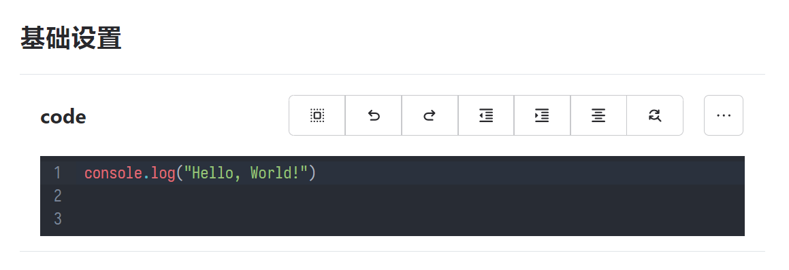

# koishi-plugin-codemirror

启用此插件将为 Koishi 控制台的 `string` 类型配置构型提供一个 `codemirror` `role`，用于将字符串配置项变成一个代码编辑框。

~~~typescript
export interface Config {
  code: string
}

export const Config: Schema<Config> = Schema.object({
  code: Schema.string().role("codemirror").default('console.log("Hello, World!")\n\n'),
})
~~~

即可在你的插件配置中添加一个 JavaScript 代码编辑框。

`.role("codemirror")` 还接受第二参数 `extra`，接受一个带有 `lang` 属性的对象，可更改编辑语言，目前支持的值有 `json`、`yaml`/`yml`。
