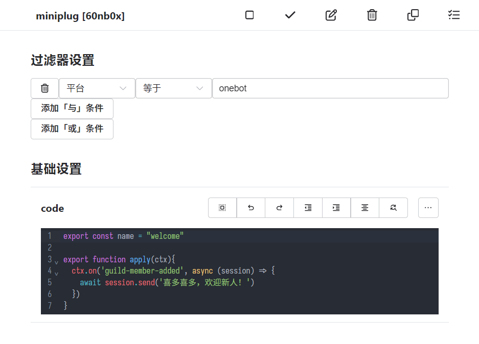

# koishi-plugin-miniplug

 

在 Koishi 控制台中编写简单 JavaScript 插件

## 用法

安装 [`koishi-plugin-codemirror`](plugins/codemirror/) 和 `koishi-plugin-miniplug`。添加并启用控制台插件 `codemirror` 后，就可以添加任意数量的 `miniplug` 插件，然后通过其 `code` 配置项编写自定义插件了。
